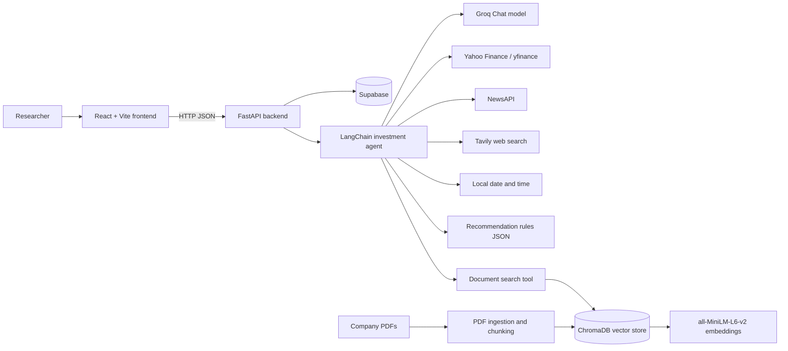
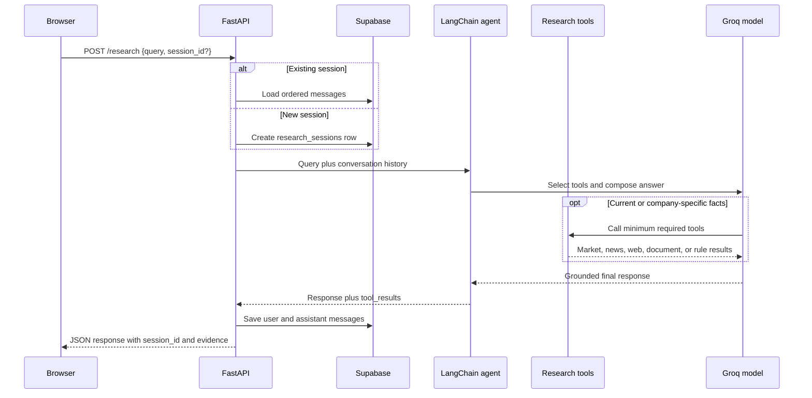
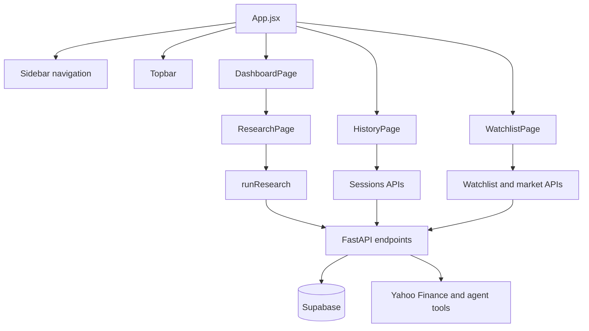

# Investment Research Agent

An AI-powered investment research workspace for researching public companies, market data, financial news, SEC filings, earnings reports, watchlists, and persistent research conversations.

The project has two applications:

- `backend/`: FastAPI API, LangChain agent, financial tools, Supabase persistence, and the local document RAG pipeline.
- `frontend/`: React and Vite dashboard for research, history, watchlists, metrics, charts, and evidence sources.

> This application provides research assistance, not financial advice. Market data and third-party API responses can be delayed, incomplete, or unavailable.

## Features

- Natural-language financial research through a tool-using LangChain agent.
- Company fundamentals and six-month price history through Yahoo Finance via `yfinance`.
- Recent financial news from NewsAPI with simple positive, negative, or neutral sentiment labels.
- Broader financial web research through Tavily.
- Local semantic search over company filings and reports using ChromaDB and Hugging Face embeddings.
- Rule-based `BUY`, `HOLD`, or `AVOID` evaluation using configurable thresholds.
- Persistent research sessions and messages stored in Supabase.
- Watchlist management with market snapshots and price charts.
- Evidence display for tool results, news, document excerpts, and source metadata.

## Architecture

### System Overview



### Research Request Flow



### Local Document RAG Pipeline

```mermaid
flowchart TD
    PDFs[backend/documents/{company}/*.pdf] --> Read[Read PDF pages with PyMuPDF]
    Read --> Markdown[Convert pages to Markdown]
    Markdown --> Split[Recursive text chunker]
    Split --> Metadata[Attach company, document type, source, and page]
    Metadata --> Embed[Hugging Face sentence embeddings]
    Embed --> Store[Rebuild ChromaDB collection]
    Query[Agent document_search query] --> EmbedQuery[Embed query]
    EmbedQuery --> Search[Similarity search, k=4]
    Store --> Search
    Search --> Evidence[Return excerpts and provenance]
    Evidence --> Agent[Agent final response]
```

### Frontend Navigation and Data Flow



## Repository Layout

```text
.
├── backend/
│   ├── .env.example                    Required environment variable template
│   ├── main.py                         FastAPI routes and market endpoints
│   ├── agent.py                        LangChain agent and tool collection
│   ├── database.py                     Supabase client initialization
│   ├── logger.py                       Application logging configuration
│   ├── prompts.py                      Agent scope, grounding, and routing rules
│   ├── config/
│   │   └── recommendation_rules.json   BUY/HOLD/AVOID thresholds
│   ├── documents/                      Source PDFs grouped by ticker
│   ├── chroma_db/                      Local generated vector-store data (ignored)
│   ├── rag/
│   │   ├── ingest.py                   PDF ingestion and embedding creation
│   │   ├── retriever.py                Semantic document search tool
│   │   ├── text_chunker.py             Text and table-aware chunking
│   │   ├── table_parser.py             Structured table parsing helpers
│   │   └── table_section_splitter.py   Table-section boundary handling
│   └── tools/
│       ├── market.py                   Fundamentals and price history
│       ├── news.py                     NewsAPI retrieval and sentiment
│       ├── web_search.py               Tavily search
│       ├── datetime_tool.py            Current date and time
│       └── recommendation.py            Rule-based recommendation
├── frontend/
│   ├── package.json                    Vite scripts and frontend dependencies
│   ├── vite.config.js                  Vite, React, and Tailwind configuration
│   ├── eslint.config.js                ESLint configuration
│   ├── index.html                      Browser entry document
│   ├── public/                         Static public assets
│   └── src/
│       ├── main.jsx                    React bootstrap and StrictMode root
│       ├── App.jsx                     Application shell and page routing
│       ├── index.css                   Global styles and Tailwind entry
│       ├── services/api.js              Backend HTTP client
│       ├── pages/
│       │   ├── DashboardPage.jsx       Dashboard and embedded research view
│       │   ├── ResearchPage.jsx        Query submission and session loading
│       │   ├── HistoryPage.jsx          Persistent session history
│       │   └── WatchlistPage.jsx        Watchlist CRUD and market data
│       └── components/
│           ├── charts/PriceChart.jsx   Historical price chart
│           ├── dashboard/               Dashboard cards and previews
│           ├── layout/                  Sidebar and top navigation
│           ├── research/                Research input, results, sources, sentiment
│           └── ui/                      Loading, empty, and section states
├── latest/                              Separate frontend snapshot, not active
└── README.md
```

Generated or local-only paths such as `backend/.venv/`, `backend/chroma_db/`, Python caches, `node_modules/`, and `.env` are excluded from the source layout above. The `latest/` directory is a separate frontend snapshot and is not the active frontend used by the project. Run the application from `backend/` and `frontend/`.

### Module Reference

**Backend**

- `main.py` exposes health, research, session, watchlist, company overview, and price-history endpoints.
- `agent.py` builds the Groq-backed LangChain agent, injects conversation history, and normalizes returned tool messages.
- `database.py` creates the Supabase client from environment variables.
- `prompts.py` defines the finance-only scope, evidence-grounding rules, tool-selection policy, and response style.
- `logger.py` provides the shared logger used by the agent and tools.
- `rag/ingest.py` converts PDFs into metadata-rich embedded chunks; `rag/retriever.py` searches the persisted collection.
- `rag/text_chunker.py`, `rag/table_parser.py`, and `rag/table_section_splitter.py` preserve readable text and table sections during document preparation.
- `tools/market.py`, `tools/news.py`, `tools/web_search.py`, `tools/datetime_tool.py`, and `tools/recommendation.py` implement the agent's external and deterministic capabilities.

**Frontend**

- `App.jsx` owns page selection and the active research session.
- `Sidebar.jsx` and `Topbar.jsx` provide the application shell and navigation.
- `DashboardPage.jsx` combines recent sessions, watchlist previews, and research.
- `ResearchPage.jsx` submits queries, loads session messages, and requests chart history.
- `HistoryPage.jsx` lists and continues saved conversations.
- `WatchlistPage.jsx` adds, removes, refreshes, and displays tracked symbols.
- `ResearchResult.jsx`, `SourceList.jsx`, `SentimentBadge.jsx`, and `PriceChart.jsx` render research evidence and visualizations.
- `MetricCard.jsx`, `QuickActions.jsx`, `RecentResearch.jsx`, `WatchlistPreview.jsx`, and `WatchlistSparkline.jsx` compose dashboard summaries.
- `EmptyState.jsx`, `LoadingState.jsx`, and `SectionHeader.jsx` provide shared UI states.
- `services/api.js` centralizes requests for research, sessions, watchlists, market overviews, and price history.

## Prerequisites

- Python 3.10 or newer.
- Node.js 18 or newer and npm.
- A Supabase project with the tables described below.
- API keys for Groq, NewsAPI, and Tavily.
- Internet access for Yahoo Finance, NewsAPI, Tavily, Groq, and the initial embedding model download.

## Backend Setup

From the repository root on Windows PowerShell:

```powershell
cd backend
py -m venv .venv
.\.venv\Scripts\Activate.ps1
python -m pip install --upgrade pip
pip install fastapi "uvicorn[standard]" python-dotenv supabase yfinance httpx tavily-python langchain langchain-core langchain-groq langchain-chroma langchain-huggingface langchain-text-splitters pymupdf pymupdf4llm chromadb sentence-transformers
Copy-Item .env.example .env
```

On macOS/Linux, replace activation with `source .venv/bin/activate` and copy the environment file with `cp .env.example .env`.

Fill in `backend/.env`:

```dotenv
GROQ_API_KEY=your_groq_api_key
SUPABASE_URL=https://your-project.supabase.co
SUPABASE_KEY=your_supabase_key
NEWS_API_KEY=your_newsapi_key
TAVILY_API_KEY=your_tavily_api_key
```

Never commit `.env` or expose these values in the frontend.

### Supabase Tables

The current API expects these tables and fields:

- `research_sessions`: `id`, `title`, `created_at`.
- `messages`: `id`, `session_id`, `role`, `content`, `tool_results`, `created_at`.
- `watchlist`: `id`, `symbol`, `company_name`, `created_at`.

`messages.session_id` should reference `research_sessions.id`. Configure delete behavior according to the desired session cleanup behavior. The application uses the Supabase Python client directly and does not include SQL migrations in this repository.

### Build the Local Document Index

The repository includes document folders for `AAPL`, `MSFT`, and `NVDA`. To rebuild the ChromaDB index after adding or changing PDFs:

```powershell
cd backend
.\.venv\Scripts\Activate.ps1
python rag/ingest.py
```

Ingestion deletes and recreates `backend/chroma_db/`. Each PDF page is converted to Markdown, split into chunks, embedded with `sentence-transformers/all-MiniLM-L6-v2`, and stored with company, document type, source filename, and page metadata.

### Run the Backend

```powershell
cd backend
.\.venv\Scripts\Activate.ps1
uvicorn main:app --reload --host 127.0.0.1 --port 8000
```

The API will be available at `http://127.0.0.1:8000`. FastAPI's interactive documentation is available at `http://127.0.0.1:8000/docs`.

## Frontend Setup and Run

In a second terminal:

```powershell
cd frontend
npm install
npm run dev
```

Open `http://localhost:5173`. The frontend currently calls the backend at `http://127.0.0.1:8000`; update `frontend/src/services/api.js` if the backend host or port changes.

Available frontend commands:

```powershell
npm run dev       # Start Vite development server
npm run build     # Create a production build
npm run lint      # Run ESLint
npm run preview   # Preview the production build
```

## API Reference

### Health and diagnostics

| Method | Endpoint | Purpose |
| --- | --- | --- |
| `GET` | `/` | API identification message |
| `GET` | `/health` | Basic health check |
| `GET` | `/supabase-test` | Reports whether the Supabase client was created |

### Research and sessions

| Method | Endpoint | Purpose |
| --- | --- | --- |
| `POST` | `/research` | Run research and persist the conversation |
| `GET` | `/sessions` | List research sessions, newest first |
| `GET` | `/sessions/{session_id}/messages` | Load a session's messages |
| `DELETE` | `/sessions/{session_id}` | Delete a research session |

Example research request:

```json
{
  "query": "Compare NVIDIA's fundamentals with risks in its 10-K.",
  "session_id": null
}
```

The response includes `success`, `session_id`, `query`, `response`, and `tool_results`. Send the returned `session_id` in later requests to continue the conversation.

### Watchlist and market data

| Method | Endpoint | Purpose |
| --- | --- | --- |
| `GET` | `/watchlist` | List saved symbols |
| `POST` | `/watchlist` | Add a symbol and optional company name |
| `DELETE` | `/watchlist/{symbol}` | Remove a symbol |
| `GET` | `/market/{symbol}` | Return current company and fundamentals data |
| `GET` | `/market/{symbol}/history` | Return six months of closing prices |

Example watchlist request:

```json
{
  "symbol": "NVDA",
  "company_name": "NVIDIA Corporation"
}
```

## Agent Tools and Routing

The system prompt in `backend/prompts.py` keeps the agent focused on finance and directs it to use the minimum number of tools necessary:

| Tool | Use |
| --- | --- |
| `market_data` | Current price, valuation, fundamentals, and optional historical prices |
| `financial_news` | Relevant financial news from the last 30 days and basic sentiment |
| `web_search` | Broader or current financial information not covered by specialized tools |
| `current_datetime` | Interpreting requests such as “today,” “latest,” or “this week” |
| `document_search` | Local AAPL, MSFT, and NVDA filings and earnings reports |
| `investment_recommendation` | Explicit recommendation requests after fundamentals are retrieved |

For recommendation requests, the agent first retrieves fundamentals and then passes those metrics to the rule engine. The rule engine reads `backend/config/recommendation_rules.json` and returns `BUY`, `HOLD`, or `AVOID` based on the majority classification of known metrics. Missing metrics are classified as `unknown` and do not count toward the majority.

## Data and Evidence Behavior

- Current and company-specific claims should be grounded in a tool response.
- Agent tool results are returned to the frontend and stored with the assistant message in Supabase.
- Document results include the excerpt, ticker, document type, source filename, page, and similarity score.
- Market data is sourced from Yahoo Finance through `yfinance`.
- News sentiment is a lightweight keyword comparison; it is not a machine-learning sentiment model.
- The local vector store is persisted in `backend/chroma_db/` and can be regenerated from the PDFs.

## Development Notes

- CORS currently allows `http://localhost:5173` only.
- The backend loads environment variables with `python-dotenv` from the process environment or `backend/.env`.
- The Groq model configured in `backend/agent.py` is `openai/gpt-oss-120b` with temperature `0`.
- The frontend uses React 19, Vite, Tailwind CSS 4, `react-markdown`, and Lucide icons.
- There is no automated backend test suite or migration system in the repository at present. Validate changes with the API health endpoint, frontend lint/build, and targeted tool checks.

## Troubleshooting

### The backend fails during startup

Check that all required values in `backend/.env` are populated, especially `GROQ_API_KEY`, `SUPABASE_URL`, and `SUPABASE_KEY`. The Supabase client is created during backend import, so missing database configuration can prevent startup.

### Research returns an API-key error

`financial_news` and `web_search` return explicit errors when `NEWS_API_KEY` or `TAVILY_API_KEY` is missing. Add the key to `backend/.env` and restart Uvicorn.

### Document search returns no useful results

Confirm that PDFs exist under `backend/documents/{AAPL,MSFT,NVDA}/`, run `python rag/ingest.py`, and restart the backend so the rebuilt ChromaDB collection is loaded.

### The frontend cannot reach the backend

Start Uvicorn on `127.0.0.1:8000`, start Vite on `localhost:5173`, and verify the URL in `frontend/src/services/api.js`. Browser CORS errors usually mean the frontend origin does not match the backend's configured `allow_origins` value.

## License

No license file is currently included in this repository.
